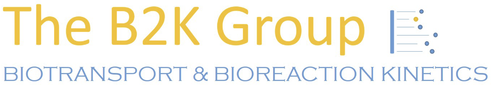

# **Interpreting Crowding Effects on FRET Signals for Protein Kinetics Analysis**

This is Mandy's personal website for research! I'm learning how to create a website using RStudio and how to host it on GitHub.

## Abstract

   In biological studies in vitro and in vivo, techniques involving Förster resonance energy transfer (FRET) and FRET quantification use the interaction of CyPet-SUMO1 and its E2 ligase, YPet-Ubc9, to determine the dissociation constant (KD). Dipole-dipole resonance interactions, where energy transfers from an excited donor to an acceptor chromophore, allow the detection of molecular interactions to elucidate protein interactions in many regulatory cascades spanning signal transduction, medical diagnostics, and optical imaging. This study aims to explore how protein-protein interactions are affected by the crowded environment typically found within cells using FRET signals. An in vitro assay using a 96-well plate was conducted using varying concentrations of bovine serum albumin (BSA) to simulate crowded conditions and determine their effect on KD values. FRET measurements were conducted in a solution phase to mimic the protein interaction affinity in living cells. In contrast, other KD measurement methods such as radio-labeled ligand binding assay, surface plasmon resonance (SPR), or isothermal titration calorimetry (ITC) require extensive preparation or orientation on solid surfaces, making them less representative for such assessments. Emission wavelengths from CyPet-SUMO1 (414 nm to 475 nm) and YPet-Ubc9 (475 nm to 530 nm) were obtained to determine fluorescence signals along with KD. A comparison between protein interactions in crowded and uncrowded settings was made with varying KD value results. This investigation provides insights into protein interactions and cellular crowding, with potential implications for pharmaceuticals, bioseparations processes, and drug discovery targeting protein-protein interactions.

### [The B2K Group](https://b2k.engr.ucr.edu/)

